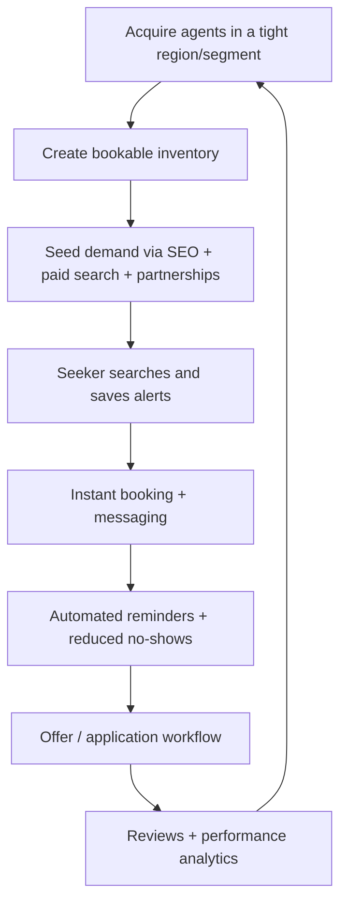

# Positioning and Commercial Strategy for the Estate Agent Platform

## Executive summary

The supplied specification describes an ambitious, full‑stack UK-first property marketplace spanning agent listing management, consumer search and discovery, booking, messaging, analytics, payments, moderation, and compliance. The commercial challenge is not feature completeness; it’s **winning distribution in a market with entrenched network effects**. Two‑sided market theory is blunt here: marketplaces must get “both sides on board”, and pricing/feature choices have to be optimised around cross‑side network effects and liquidity. citeturn1search7turn1search15turn3search11

In the UK, the consumer “portal” layer is dominated by incumbents with large audiences and strong direct/organic traffic. For example, entity["organization","Rightmove","uk property portal"] reported 2025 revenue of £425.1m, total membership of 19,272 branch equivalents, and total ARPA (average revenue per advertiser per month) of £1,621. citeturn21view0 It also reported >80% share of time on UK property portals (per Comscore) and 16.8bn minutes spent on its platform in 2025. citeturn21view0 Incumbents are also moving “down funnel” into workflow (e.g., trialled “Book a Viewing” on lettings listings via Viewings Manager, including pre‑qualification, scheduling and reminders). citeturn12view0

Given that reality, the best path to a viable business is to **avoid positioning as “yet another portal”** (a demand-side land‑grab you will probably lose) and instead position as an **agent conversion OS**: a workflow + marketplace hybrid that (a) produces measurable ROI for agents (reduced admin, fewer no‑shows, faster fill/offer cycles), and (b) creates a distinctive consumer promise (“bookable, responsive listings”) that is hard to copy without deep operational integration.

A pragmatic success strategy in the entity["country","United Kingdom","country"] is therefore:

- **Wedge on B2B value first** (agency productivity + conversion), because agent spend signals are strong (Rightmove ARPA is a visible proxy for willingness to pay on distribution). citeturn21view0  
- **Build a “bookable inventory” advantage**: real-time slots, calendar sync, automatic reminders, and response SLAs. Incumbents have elements of this, but the opportunity is to go further (cross-channel workflow, better scheduling UX, stronger analytics attribution). citeturn12view0turn20search8  
- **Concentrate geographic and segment focus** to achieve local liquidity (e.g., rentals in a few cities, or independent agencies in a region) rather than attempting national coverage on day one. UK transactions run at roughly ~1m+ residential completions per year (order of magnitude implied by HMRC’s FY-to-date figures), so the macro pool is large—but you only win if you own a tight “liquidity cell” first. citeturn18view1  
- **Monetise primarily via agent subscriptions + performance upsells** (boosted visibility, qualified leads, booking automation), with consumer monetisation as optional/secondary (UK consumers are used to free portals; paid consumer tiers can work only if they deliver a time/value advantage similar to SpareRoom’s “Early Bird”). citeturn20search3  

## What the specification describes and key strategic implications

### What is specified

The product is specified as a multi‑role platform connecting estate agents, property seekers (buyers/renters), and administrators, with end‑to‑end flows including: listing registration (including rich media), advanced search (including map-based discovery), appointment booking and calendar synchronisation, in‑app messaging, saved searches/alerts, reviews/ratings, admin moderation, analytics, billing, and strict compliance/security requirements (GDPR workflows, AML‑aligned agent verification, and accessibility). The spec also anticipates portal/feed integrations (Rightmove/Zoopla/OnTheMarket style syndication) and a phased delivery plan including native apps and payments.

Strategically, that implies you are building **two products at once**:

1) a **B2B productivity + lead management layer** (listing ops, messaging, diary, analytics, billing), and  
2) a **B2C discovery layer** (search UX, alerts, maps, recommendations).

The commercial decision that matters most is: **which side is the initial wedge** and which side is “follow-on”. Two-sided platform research suggests price structure and incentives must be tuned to accelerate cross-side adoption; it is common for platforms to subsidise one side to attract the other. citeturn1search7turn1search15turn3search11

### What is unspecified (assumptions flagged)

The spec is strong on features but underspecified on business-critical constraints. The analysis below therefore assumes:

- **Primary launch region**: UK-first (as per spec), with phased localisation later.  
- **Supply acquisition model**: agents upload listings (direct or via feed) and accept marketplace leads.  
- **Differentiation goal**: “reduce time-to-transaction” is a business objective, not just a UX aspiration.  
- **Budget and runway**: not given; GTM choices below include both lean and capital-intensive variants.  
- **Data access**: portal/feed integrations may exist for *syndication to portals* (common) rather than *importing portal inventory from competitors* (often restricted). Rightmove’s Automated Datafeed documentation demonstrates a controlled testing and onboarding process for feed providers. citeturn13view0  

## Target users, personas and willingness to pay

### Target users and personas (with behavioural drivers)

The spec already identifies four personas (agents/agencies; buyers; renters; admins). The commercially decisive ones are: **agents (payers)** and **renters/buyers (traffic + conversion)**.

**Agent / agency (payer) segments**

- **Independent/small agencies (1–5 branches, low ops maturity)**  
  Behaviour: high admin burden; fragmented tools; owner-operator decision making; responsive to clear ROI and low switching friction.  
  Pain points: lead management chaos, diary coordination, follow-up discipline, portal fee pressure, poor attribution. A market signal for willingness to pay is that portals can monetise at scale: Rightmove’s 2025 total ARPA was £1,621 per advertiser per month, with agency ARPA £1,530. citeturn21view0  
  WTP: typically willing to pay if you can (a) cut admin hours, (b) reduce no-shows, (c) increase conversion rate, or (d) reduce total portal spend. (Exact budgets vary; incumbents’ ARPA is a proxy for “distribution WTP”, not necessarily “workflow WTP”.)

- **Mid-market agencies (multi-branch, ops/process heavy)**  
  Behaviour: more formal buying process; integration requirements (CRM, feeds, call tracking, reporting); higher switching costs.  
  Pain points: multi-branch diary coordination, data quality and compliance, attribution across channels.  
  WTP: higher ACV possible, but only with credible integrations and enterprise features.

- **Lettings-heavy operators**  
  Behaviour: high volume, high time sensitivity; scheduling and no-shows are acute; strong need for automation.  
  Pain points: viewing coordination, applicant triage, diaries, reminders. This is a proven software category: Reapit markets “Bookings” explicitly as turning portal leads into viewings and letting renters “book viewings straight into your diary”. citeturn20search8  
  WTP: strong if you can show faster fill and reduced admin.

**Property seekers (traffic + conversion) segments**

- **Renters (high frequency, high urgency)**  
  ONS data indicates the private rented sector (PRS) comprised 19% of UK households in YE March 2024, and has been broadly stable since 2017. citeturn18view0 PRS household reference persons skew younger: 32% are aged 25–34 and 24% are 35–44. citeturn18view0  
  Behaviour: fast scanning, immediate outreach, preference for messaging over calls; frustration with slow replies. (Zoopla’s consumer help content even suggests allowing agents up to 3 business days to reply—an implicit admission that responsiveness is a problem.) citeturn11search3  
  WTP: low for general search (free expectations), but some willingness to pay for *speed advantages* (cf. SpareRoom’s Early Bird access pricing, £14 for 7 days / £25 for 14 / £28 for 28). citeturn20search3

- **Buyers (lower frequency, higher stakes)**  
  Behaviour: more research-heavy; map and travel-time filters; saved alerts; willingness to share documents once serious.  
  WTP: generally low for search, higher for services that reduce transaction friction and risk (but many of those are in the mortgage/conveyancing ecosystem, not yet in scope).

### Willingness to pay (WTP) summary

The most reliable monetisation path is **agent-side subscription + performance upsells**, because:

- Agent-side spend is already structurally large (Rightmove ARPA as a benchmark for “marketing distribution spend”). citeturn21view0  
- Consumer-side paid models can work only if you create a **time advantage** (priority access, faster booking, verified responsiveness) comparable to SpareRoom’s gating model. citeturn20search3  

## Feature-to-value map and differentiation strengths

### Core value propositions

To succeed commercially, the platform’s positioning should be framed around **measurable conversion outcomes**, not around being “full-stack” or “AI-powered”. Incumbents can outspend on feature checklists; you win by owning a business outcome.

A useful framing is:

- **For agents**: “Turn portal-style interest into confirmed viewings and qualified offers with less admin and better attribution.”  
- **For renters/buyers**: “Find bookable listings and get real responses fast—no phone tag.”

### Mapping features to user benefits

| Spec feature cluster | Who benefits | Practical user benefit (why they care) | Monetisable lever |
|---|---|---|---|
| Listing creation, bulk import, media support, status mgmt | Agents | Less time per listing; faster time-to-market; consistent data quality | Subscription tiers; “pro media” upsells |
| Search/filtering, map view, polygon draw | Seekers | Higher relevance; neighbourhood precision; fewer wasted leads | Traffic growth → leads sold to agents |
| Recommendations + saved searches/alerts | Seekers | Habit loop; reduces missed opportunities; return visits | Increased MAU/DAU, ad inventory, lead volume |
| Appointment booking + calendar sync + reminders | Both | **Eliminates back-and-forth**; reduces no‑shows; diary certainty | Premium “Bookings” module; per-booking fees |
| Secure messaging + templates + attachments | Both | Faster responses; documented record; less email sprawl | Premium messaging/automation; compliance-grade retention |
| Reviews/ratings and verification | Seekers & agents | Trust, reduced fraud; improves lead quality | “Verified” badge as paid tier; trust increases conversion |
| Agent analytics dashboard | Agents | ROI measurement; pricing/marketing decisions; coaching | Higher willingness to pay; enterprise upsell |
| Admin moderation + fraud detection + GDPR workflows | Platform | Trust and compliance; brand safety | Required for scale; reduces downstream costs |

### Differentiation strengths that matter

**“Bookable inventory + response SLA” is the strongest differentiator** because it solves a pain point users can feel instantly. This is also consistent with incumbent movement: Rightmove’s Viewings Manager trial aimed to let applicants request/confirm/cancel viewings with reminders, explicitly to address communication preferences and no-shows. citeturn12view0 Reapit similarly positions booking automation as an admin and fill-rate improvement. citeturn20search8

Therefore, differentiation must go beyond “we also have booking” into **operational superiority**:

- Real-time slot logic + two-way calendar sync (and a genuinely pleasant UX).  
- Cross-channel lead handling (inbox + tasks + reminders) with measurable attribution.  
- Stronger verification and quality controls to reduce fraud and stale listings.

## Competitive landscape and market dynamics

### Competitive landscape overview

The platform sits at the intersection of **portals** (demand generation) and **agent workflow software** (supply operations). Competitors exist in both layers, and several incumbents are converging.

#### Competitor comparison table

| Player | Category | Primary customer | Evidence of strength | Key weakness/opportunity for your positioning |
|---|---|---|---|---|
| **entity["company","Rightmove","uk property portal"]** | Portal + expanding workflow | Agents (B2B revenue) + consumers (traffic) | 2025: £425.1m revenue; 19,272 members; total ARPA £1,621; >80% share of time (per Comscore) and 16.8bn minutes spent. citeturn21view0 | Must differentiate on **conversion workflow depth**, not just audience. Booking exists (at least for trials/segments), so you need better diary sync + messaging + analytics. citeturn12view0 |
| **entity["company","Zoopla","uk property portal"]** | Portal + agent products | Consumers + agents | Consumer features include map view with draw-your-own area and travel-time search (public app/store messaging). citeturn2search5turn2search17 Accounts (year ended 31 Dec 2024) show revenue £84.167m and operating profit £15.679m. citeturn8view3 | Opportunity is “bookable, responsive listings” and faster two-way workflows; consumer contact delays are acknowledged in help guidance. citeturn11search3 |
| **entity["company","OnTheMarket","uk property portal"]** (owned by **entity["company","CoStar Group","real estate data company"]**) | Portal (investing heavily) | Agents + consumers | Claimed >14,000 advertisers after acquisition and significant planned marketing investment. citeturn1search13turn1search9 | Third portal is attempting to scale fast; you need a sharper wedge than “another portal with listings.” |
| **entity["company","OpenRent","uk rental platform"]** | Rentals marketplace + services | Landlords + tenants | Provides a viewing booking system and other rental process tooling; also offers paid viewing services (e.g., accompanied viewings £47 inc VAT). citeturn1search6turn1search10 | Strong in landlord-direct rentals; opportunity for you is the *agent-led* segment plus broader sales market. |
| **entity["company","SpareRoom","uk flatshare platform"]** | Rooms marketplace | Renters + room listers | Proven consumer monetisation via time advantage: Early Bird pricing £14/7 days, £25/14 days, £28/28 days. citeturn20search3 | Narrow category (rooms) but demonstrates that **speed gating** can monetise consumers if value is obvious. |
| **entity["company","Reapit","estate agency software company"]** | Agent CRM/workflow | Agents | Markets booking automation: “let renters book viewings straight into your diary”; broader mobile CRM + diary features. citeturn20search8turn20search0 | Competes for agent workflow budget; your advantage must be combining workflow with a marketplace and better consumer experience. |
| **entity["company","Jupix","estate agency software company"]** | Agent software | Agents | Positions diary and viewing coordination as core functionality. citeturn20search1 | Workflow-only; you can differentiate by adding demand + conversion analytics. |
| **entity["company","Dezrez","estate agency software company"]** | CRM + portal syndication | Agents | Explicitly markets uploading/integration with major portals including Rightmove, Zoopla and OnTheMarket. citeturn20search2turn20search10 | As with other CRMs, weak on consumer marketplace; opportunity is “bookable listings + trust layer” as a distribution wedge. |

### Feature set comparison table

The following focuses on user-visible and conversion-critical capabilities (not internal architecture).

| Feature | Rightmove | Zoopla | OnTheMarket | OpenRent | SpareRoom | Reapit (agent workflow) |
|---|---|---|---|---|---|---|
| Polygon/drawn-area search | Yes. citeturn2search0 | Yes. citeturn2search5 | Unclear publicly (varies by UX) | Not core | Not core | No (workflow tool) |
| Travel/commute time search | Not evidenced here | Yes (app messaging). citeturn2search17 | Unclear publicly | Not core | Not core | No (workflow tool) |
| “Book a viewing” flow within platform | Partial/segment-specific (Viewings Manager trial for lettings). citeturn12view0 | Not evidenced here (agent contact emphasis). citeturn11search3 | Not evidenced here | Some booking tooling exists. citeturn1search6 | Not core | Yes (bookings into diary). citeturn20search8 |
| Diary/calendar-first workflow | Limited (Rightmove Plus for partners). citeturn12view0 | Not evidenced here | Not evidenced here | Partial (calendar mention). citeturn1search6 | No | Yes (CRM diary). citeturn20search0 |
| Consumer-paid speed advantage | No | No | No | Not core | Yes (Early Bird). citeturn20search3 | N/A |

### Pricing and monetisation signals table

Direct competitor price cards for portals and CRMs are often quote-based or opaque; where list pricing is not public, the most defensible comparison is via disclosed revenue/ARPA or clearly stated consumer pricing.

| Competitor | What is publicly observable | What it implies for your pricing |
|---|---|---|
| Rightmove | Total ARPA £1,621 per advertiser/month in 2025 (agency ARPA £1,530). citeturn21view0 | Agent willingness to pay for distribution is high; a workflow product priced at a fraction of portal spend can still be meaningful if ROI is provable. |
| Zoopla | Revenue £84.167m (2024) from filed accounts. citeturn8view3 | There is a large #2 portal business with capacity to bundle services; you should expect bundling pressure. |
| SpareRoom | Early Bird: £14/7d, £25/14d, £28/28d. citeturn20search3 | Consumers will pay for **time advantage** in high-urgency markets if it is concrete and immediate. |
| OpenRent | Paid service line-item example: accompanied viewings £47 inc VAT. citeturn1search10 | Transactional add-ons work when they remove hassle; similar logic can apply to “hosted open house”, “ID-verified applicant pack”, etc. |

## Market size, growth and unit economics model

### Demand-side context (UK households and renting)

entity["organization","Office for National Statistics","uk statistics agency"] estimated **28.6 million UK households in 2024**. citeturn3search1 The PRS was **19% of UK households** in YE March 2024 and has been broadly stable since 2017. citeturn18view0 That implies ~5.4m renting households (28.6m × 19%). citeturn3search1turn18view0

UK residential transactions (a proxy for annual move completions) run at roughly ~1m+ per year: HMRC’s seasonally adjusted FY-to-date series for April–February 2025–26 is 1,033,560 (provisional), indicating annual magnitude around the low millions. citeturn18view1

### Supply-side context (estate agency universe)

An ONS ad hoc analysis of UK SIC Division 68 subclasses reports **24,500 enterprises in SIC 68310 (real estate agencies)** (timeframe shown as 2015–2022; the snippet indicates the enterprise count at the end of that range). citeturn0search1 This is directionally consistent with a fragmented supply base: many small operators plus multi-branch chains.

### TAM / SAM / SOM estimates (with explicit assumptions)

Because your platform blends portal + workflow, there are two reasonable TAM framings. Both are useful; neither is “the one true number”.

#### TAM framing A: UK portal + adjacent marketplace revenues (top-down proxy)

- Rightmove 2025 revenue: **£425.1m**. citeturn21view0  
- Zoopla (Zoopla Limited) 2024 revenue: **£84.167m** (filed accounts). citeturn8view3  

These two alone sum to ~£509m/year, before counting OnTheMarket and other portals/services. Given OnTheMarket’s scale and additional adjacent property marketplaces, a reasonable **UK “portal + marketplace + associated services” TAM proxy is ~£550m–£700m/year**, depending on what you include (strict portal ads only vs broader adjacent revenue lines). citeturn21view0turn8view3turn1search13

#### TAM framing B: Agent workflow + conversion SaaS (bottom-up)

Assumptions (explicit, because the spec does not set pricing):
- Addressable “branch equivalents”: 16k–25k (bounded by Rightmove agency branches 16,385 in 2025 and ONS enterprise count 24,500). citeturn21view0turn0search1  
- Average achievable net subscription+usage revenue per branch per month (blended): £150–£500 (depends on packaging and penetration of add-ons such as bookings, promoted listings, etc).

This yields an agent SaaS TAM range:

- Low: 16k × £150 × 12 ≈ **£28.8m/year**  
- Mid: 20k × £300 × 12 ≈ **£72m/year**  
- High: 25k × £500 × 12 ≈ **£150m/year**  

This TAM is smaller than portal TAM because it targets workflow budget rather than dominant consumer demand capture—but it is **more winnable** for a new entrant.

#### SAM and SOM (pragmatic launch model)

A credible SAM for the first 24 months should be defined by where you can reach liquidity:

- **SAM (initial): letting-heavy independent and mid-market agencies in a small set of cities/regions** (e.g., 2,000–5,000 branches). Rationale: rentals are higher frequency and scheduling benefits are immediate; it also matches demonstrated market demand for booking tools. citeturn12view0turn20search8  
- **SOM (3 years): 1–3% of SAM paid conversion**, assuming a focused sales motion and product‑led onboarding, equating to ~20–150 paying branches per target region or 200–1,500 nationally depending on expansion pace. (This is intentionally a broad range; exact SOM depends on CAC efficiency and churn.)

### Unit economics model (illustrative, assumptions flagged)

Marketplace economics require discipline. The right model is usually a hybrid of:
- subscription (predictability),  
- usage/performance (align incentives), and  
- premium inventory (profit expansion).

A simple SaaS unit model:

- Monthly gross margin (GM): 75–90% (hosting + support + messaging/SMS costs).  
- Monthly churn: 1–3% (agent SaaS varies by segment; multi-branch tends to churn less, micro-agencies more).  
- LTV (gross margin basis) ≈ (ARPA × GM) / churn.

Example (mid-market subscription):
- ARPA: £299/month  
- GM: 85%  
- churn: 1.5%/month  
- LTV ≈ (£299 × 0.85) / 0.015 ≈ **£16.9k** per branch-equivalent.

Payback depends on CAC. With CAC £2,000 per branch, margin contribution £254/month, payback ≈ **7.9 months**. (These are not facts; they are planning numbers that must be validated.)

## Go-to-market, retention, MVP scope, roadmap, risks and positioning

### Go-to-market strategies and channels

A viable GTM plan should treat this as **B2B-led with B2C pull**, not “launch an app and hope Rightmove users show up”.

**Supply acquisition (agents)**
- **Direct sales to independent agencies** with a hard ROI pitch: fewer no‑shows + more confirmed viewings + faster fill.  
- **Integration-led partnerships** with portal feed ecosystems. Rightmove’s ADF documentation shows controlled onboarding for providers and testing; positioning as a compliant feed provider can reduce adoption friction for agencies already structured around syndication. citeturn13view0  
- **Land-and-expand**: begin with “Bookings + Inbox” as the must-have, then upsell analytics, promoted listings, and enterprise features.

**Demand generation (seekers)**
- **SEO for “book a viewing” and urgency keywords**: renters are high-intent and time-sensitive.  
- **Paid search** targeting “rent in [area] book viewing” and “pet-friendly flats [area] viewing”, tied to bookable inventory density.  
- **Partnerships** with local employers/universities for renter funnels (lightweight, but can be cost-effective in cities).

Below is a simple GTM flow that matches the two-sided reality.

### Retention and engagement tactics

**For seekers**
- *Alerts as habit engine*: saved searches + instant notifications (already in spec), but tune for relevance to avoid “email flood” backlash (a known consumer complaint pattern across portals). citeturn11search3  
- *Post-viewing loop*: feedback capture, “recommended next” based on viewing history, and a clear “what to do next” checklist.  
- *Trust features*: verified agents and response-time indicators; consumers will trade attention for reduced uncertainty.

**For agents**
- *Conversion dashboards that speak money*: booked viewings → attended viewings → offers → completions.  
- *Response SLAs + nudges*: automated follow-ups if a lead is untouched after X hours; this attacks a widely felt consumer pain (slow replies). citeturn11search3  
- *No-show reduction tooling*: reminders, easy reschedule/cancel flows (incumbents recognise this value). citeturn12view0  

### Key metrics / KPIs (and why they matter)

A marketplace must track **liquidity** metrics, not vanity MAU alone.

| KPI | Definition | Why it is commercially load-bearing |
|---|---|---|
| Supply density | Active listings per target geo cell | Determines whether demand converts or bounces |
| Time-to-first-lead | Median time from listing publish to first enquiry/booking | Early signal of marketplace health |
| Booking conversion rate | % listing views → booking requests | Tests “bookable inventory” value prop |
| Attendance rate | % bookings that happen | Proxy for no-show reduction value |
| Agent response time | Median time to first reply | Directly tied to consumer satisfaction +
retention |
| CAC (agents) | Fully loaded acquisition cost per paying branch | Determines scaling pace |
| ARPA / Net revenue retention | Revenue per branch and expansion | Determines whether you can build a durable SaaS business |
| Churn | Logo and revenue churn | Drives LTV; must be constrained early |

### Business models and pricing options (recommended packaging)

A practical packaging model aligned with the spec’s subscription + premium + lead-gen intent:

**Freemium (agent)**
- Free tier: limited listings, basic profile, basic enquiries (acts as a supply seeding tool).  
- Goal: reduce time-to-first-listing and build inventory.

**Subscription (agent)**
- Starter (£99–£149/branch/month): listings, inbox, basic analytics, basic booking.  
- Pro (£249–£399/branch/month): calendar sync, automated reminders, templates, richer analytics, team features.  
- Enterprise (quote-based): SSO, advanced reporting, integrations, compliance controls.

**Performance / transactional**
- Promoted listings or “boost credits” (auction-style supply).  
- Pay-per-qualified lead (guard quality tightly, or you become a spam factory).  
- Optional transactional services later (tenant checks, mortgage partners, conveyancing)—but these are explicitly not v1 in the spec, and must not distract from the booking + conversion wedge. citeturn19search16

**Consumer monetisation (optional, only if you create a time advantage)**
- “Fast Track” subscription could be viable only if it delivers something as concrete as SpareRoom’s Early Bird: e.g., priority booking windows on high-demand rentals or additional verification. citeturn20search3

### MVP scope and prioritised roadmap

The spec’s delivery roadmap is broad; an MVP that can win must prioritise the **smallest set of features that creates measurable conversion advantage**.

**MVP principle:** deliver a loop where (1) agents can publish, (2) seekers can find, (3) seekers can book, (4) agents can respond, and (5) both sides get reminders and history.

#### Prioritised roadmap table

| Stage | Scope (what to ship) | Why it matters commercially | Defer / avoid |
|---|---|---|---|
| MVP | Agent onboarding + verification, listing CRUD + media, public search + map, booking requests + confirmations, in-app messaging, notifications, basic analytics | Creates the core “bookable inventory” loop and produces measurable ROI story | Native apps, AI chatbot, complex enrichment, deep mortgage/conveyancing |
| Early traction | Calendar sync, reminders, no-show reduction flows, lead pipeline statuses, saved searches/alerts | “Bookings that actually work” is highly defensible and retention-driving | Large-scale internationalisation, advanced AI ranking |
| Monetisation v1 | Subscription billing, promoted listings/boosts, agent performance dashboards | Converts usage into revenue; ties price to value | Overly complex pricing; ads-first consumer model |
| Expansion | Portal feed syndication (where feasible), team workflows, enterprise controls | Reduces switching costs; supports multi-branch adoption | Anything that doesn’t improve supply density or conversion |

### Risks and mitigations

**Chicken-and-egg (liquidity risk)**  
- Risk: without listings, seekers won’t come; without seekers, agents won’t pay.  
- Mitigation: B2B-led wedge + freemium supply seeding; launch in tight geo/segment cells; make booking a genuinely superior experience. Two-sided market theory supports subsidising one side to accelerate cross-side adoption. citeturn1search7turn1search15

**Incumbent response risk**  
- Risk: portals and CRMs can copy features; some already have booking initiatives. citeturn12view0turn20search8  
- Mitigation: compete on operational depth (calendar truth, attendance rate, attribution), not superficial UI toggles.

**Regulatory/compliance risk (GDPR, AML, consumer protection, accessibility)**  
- Data rights: ICO guidance describes the right to erasure (UK GDPR Article 17) and time limits for responses. citeturn19search0turn19search6  
- AML supervision: estate agency businesses must register with HMRC for money laundering supervision if performing estate agency activity. citeturn2search2  
- Misleading listings: the Consumer Protection from Unfair Trading Regulations 2008 set the framework against unfair/misleading practices. citeturn19search1  
- Accessibility: WCAG 2.2 is a W3C Recommendation and is the current standard referenced by many UK public-sector accessibility requirements. citeturn2search7turn2search11  
- Security: ISO/IEC 27001 is positioned by ISO as the best-known ISMS standard. citeturn19search9  

Mitigation: treat compliance as a product feature (trust advantage), adopt privacy-by-design, keep audit trails, and avoid “AI-first” claims you can’t validate.

**Integration/data dependency risk**  
- Risk: feed integrations are operationally heavy; portals control access and processes. Rightmove’s ADF process shows explicit testing, credentialing, and go-live gating. citeturn13view0  
- Mitigation: make integrations a phase-gated investment; win with direct listing onboarding first; partner selectively.

### Recommended positioning statement and messaging hierarchy

**Positioning statement (recommended)**  
For UK estate and letting agencies that want to convert enquiries into confirmed viewings faster, the Estate Agent Platform is a conversion-first marketplace that lets renters and buyers book viewings and message securely in minutes—cutting admin, reducing no‑shows, and proving ROI with end‑to‑end analytics.

**Messaging hierarchy**

1) **Primary promise (outcome)**: *“Book viewings faster. Close faster.”*  
2) **Pillar 1 — Bookable inventory**: real-time availability, calendar sync, reminders, fewer no-shows. (Explicitly aligned to strong market value signals from booking tools.) citeturn12view0turn20search8  
3) **Pillar 2 — Responsive communication**: secure messaging + response SLAs; reduce the “agent didn’t reply” frustration loop. citeturn11search3  
4) **Pillar 3 — Proof, not vibes**: conversion analytics from view → booking → attended → offer.  
5) **Pillar 4 — Trust + compliance**: verified agents, moderation, GDPR/AML readiness as a differentiator. citeturn2search2turn19search0turn19search1

### Suggested marketing creatives and visual concepts

The goal of creative is to **make the benefit legible in 1–2 seconds**. “Another portal” is not legible; “book it now” is.

**Creative concept set (consumer)**
- *Concept A: “No phone tag”*: Split-screen: left shows “call agent / voicemail / waiting”; right shows “pick a slot → confirmed viewing”. Headline: “See it tomorrow, not ‘sometime next week’.” (Works for renters.)  
- *Concept B: “Draw, filter, book”*: Animation: draw a polygon, apply 2 filters, tap “Book viewing”. (Leans on known behaviour: drawn-area and map search are already valued features on major portals.) citeturn2search0turn2search5  
- *Concept C: “Verified + responsive”*: Badge UI + “median response time” chip on listings.

**Creative concept set (agent)**
- *Concept D: “Diary that fills itself”*: Dashboard showing tomorrow’s diary with confirmed viewings, plus attendance rate improvement. Aligns to established booking-product messaging in agent workflows. citeturn20search8  
- *Concept E: “Stop paying for ghost leads”*: Show pipeline: enquiries → booked → attended → offers, with attribution.

image_group{"layout":"carousel","aspect_ratio":"16:9","query":["property search app map draw boundary UI","calendar booking interface mobile app appointment slots","estate agent dashboard analytics UI","in-app chat interface real estate app"],"num_per_query":1}